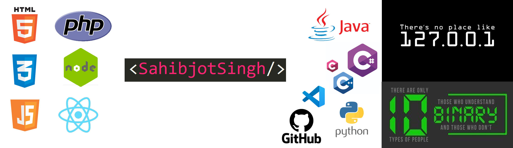

<h2> I'm a Student, Full Stack Web Developer, and Passionate!!</h2>

- 🌱 I’m currently in my High School
- 👯 I’m looking to collaborate with other developers
- 💻 I’m currently using Windows but I am a BIG fan of Mac
- 🥅 2022 Goals: Build Something Cool
- ⚡ Fun fact: I love Physics and Mathematics
 
 
<h2>Programming Languages</h2>
- HTML
- CSS
- JavaScript
- Node JS
- PHP
- JQuery
- Bootstrap
- SQL
- MySQL
- Python
- Java
- ...And Still Learning
 
 
<h2>Checkout the cool website I made :</h2>
<ul>
<li><a href="awesomeelements.co.in">Awesome Elements</a></li>
</ul>
  
<h2>Here are a few quotes from my collection</h2>

<blockquote> 
  “Java is to JavaScript what Car is to Carpet.” 
  “Learn from yesterday, live for today, hope for tomorrow. The important thing is not to stop questioning.” 
</blockquote>
